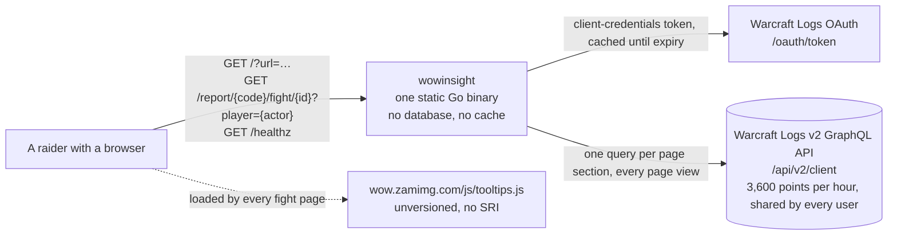
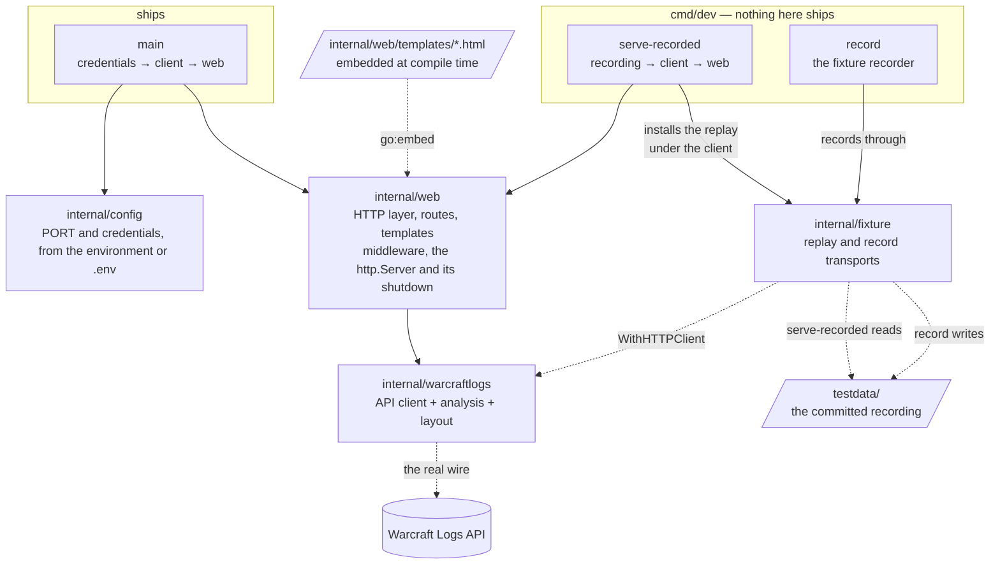
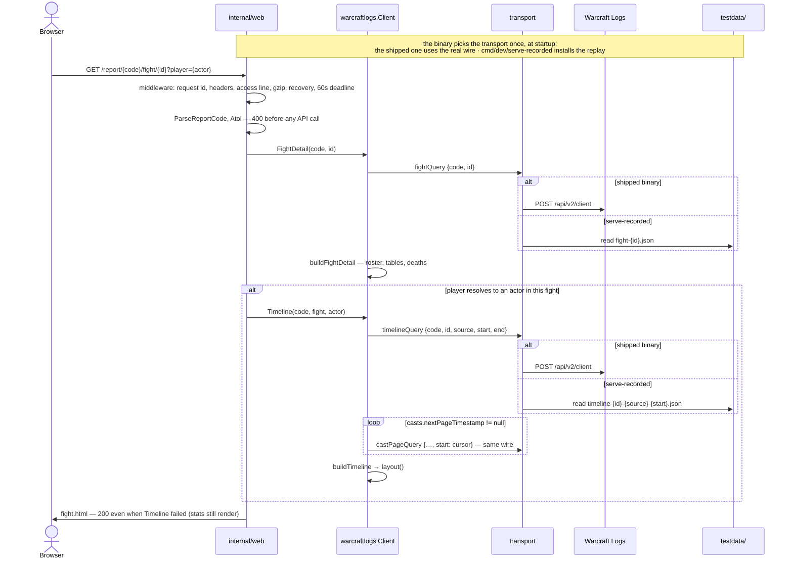

# Architecture

The map of this repository, for a human opening it cold and for an agent starting a
session. Three views, each answering one question. Read this before the code; it is
shorter than the code and it says where the seams are.

The **package view is verified by a test** (`architecture_test.go`): its solid edges must
match the real import graph, so it cannot go stale without the gate going red. The other
two views are kept true by hand — see *Keeping this true* at the end, and the rule in
`AGENTS.md`.

## 1. What talks to what

Who the system is for, and what it depends on outside the repository.

- The binary is the whole deployment. Nothing is stored between requests, so every page
  view re-queries the API against one hourly budget. #2 owns the cache; do not invent
  one.
- The tooltips script is the only third-party code that executes, and it runs with full
  origin privileges in the browser. It constrains any Content-Security-Policy work (#7).
- Credentials and `PORT` arrive from the environment, or from `.env` for local work, and
  never enter the process environment or leave it for anywhere but the OAuth endpoint.
- The process stops gracefully: SIGTERM cancels the root context, the listener closes,
  in-flight requests get eight seconds to finish — inside Cloud Run's ten.

## 2. How the code is organised

Seven packages: one that ships, two a developer runs, four they are built from. Solid
arrows are imports and are verified. Not every import is drawn: each binary also builds
the client with `warcraftlogs.New`, and all three read their configuration — those edges
are declared in the diagram source and checked, but left off the picture, because the
labels already say it and the lines would only cross what matters. Dotted arrows are
relations that are not imports, which is what makes them worth drawing — including the
two wires under the client: in the shipped binary it talks to Warcraft Logs; under
`serve-recorded` the replay transport sits beneath the same client and answers from
`testdata/`.

**The two seams**, which is where anything gets substituted:

| Seam | Declared in | What hangs on it |
| --- | --- | --- |
| `logsClient` — the four methods the handlers call | `internal/web/server.go`, by the consumer | `fakeWCL` in tests; the cache decorator #2 will add |
| `http.RoundTripper` under the client, via `WithHTTPClient` | `internal/warcraftlogs/client.go` | the recorder and the replay in `internal/fixture` |

The replay sits *under* the client rather than beside it on purpose: a fake client can
return a `Timeline`, but not a laid-out one — `layout()` is unexported and runs only
inside `(*Client).Timeline`. `cmd/dev/serve-recorded` reads the committed recording in
`testdata/` through that seam; `cmd/dev/record` is how a human makes one. Neither is in
the shipped binary, which has no offline mode. See
`docs/decisions/2026-09-11-recorded-fixtures.md`.

**Inside `internal/warcraftlogs`**, one file per concern. `FightDetail` and `Timeline` are
each split into a `fetchX` method on `*Client` that does I/O and a pure `buildX` from the
decoded response; `Report` is deliberately not, being one query and a nil check. `timeline.go` is by a wide margin the largest file — cast pairing,
aura and cooldown windows, phases and the layout pass — and its doc comments carry the
reasoning behind each heuristic. Read them before changing a builder.

**Known shape problems**, each owned by an issue: spec knowledge is package-level globals
(#16); presentation fields (`Percent`, `Row`, SVG strings) live on the analysis types
(#17); errors are strings shown verbatim (#12). `AGENTS.md` says how to build around them
in the meantime.

## 3. What happens on a fight page request

The one path that exercises everything. `Report` (the index page) is the same shape with
one query and no build step.

- The page degrades rather than fails: a `Timeline` error is logged and the stats render
  without it. Today that is indistinguishable from a player who cast nothing; #12 adds
  the notice.
- Every request gets an id (`X-Request-Id` on the response) and one access line keyed by
  the route pattern, with status, duration and the number of upstream calls. A panic is a
  500 and one ERROR line with that id; a client that went away is INFO, not an error.
- Every request has a one-minute deadline, the first end-to-end bound; the client's own
  30s timeout is per call and the cast paging multiplies it. Responses a client accepts
  gzipped are gzipped — the fight page shrinks 11–17× — and every response carries
  `nosniff`, `DENY` framing and a strict referrer policy. The CSP hook exists; its
  content is #7's.
- Every `*Timeline` a caller receives has been laid out. `layout()` is the last statement
  of `buildTimeline`, and `TestBuildTimelinePositionsEverything` pins it.
- The two binaries are one code path with a different transport underneath. Everything
  from the client up — queries, paging, `build`, `layout()`, the template — is identical,
  which is what makes the offline page trustworthy. The recorder is the third transport:
  the real wire, with a copy kept of every response.

## Keeping this true

**Read this first, then the code.** If the code and this document disagree, do not
decide which one is wrong: raise it with the owner, with both versions side by side, and
wait. A drift can mean the document rotted, or that the code took a turn nobody agreed
to — and only the owner knows which.

**Structural changes are argued to the owner before they are built**, not presented as a
finished pull request. Structural means: a new package; a new edge between packages; a
new external system or third-party script; a new entry point (a binary, a route); a
changed seam. Adding a function or a type inside a package is not structural and needs
no check-in — only the diagram edit, if any.

**The package view is tested.** `architecture_test.go` reads the flowchart marked
`%% verified: package graph`, takes its solid `-->` edges, and compares them with the
import graph `go/build` reports for every package in the module. A package or import
edge missing from the diagram fails the gate; so does an edge the code no longer has.
Node ids are the last path segment of the package (`config`, `fixture`) with hyphens as
underscores (`serve_recorded`), and `main` for the root. An edge written in a `%%` comment is verified like a drawn one and not rendered —
the escape hatch for a package whose edges would only add crossings, used by
`cmd/record`. Dotted edges (`-.->`) are not checked, which is what they are for.

**The other two views are prose-maintained.** The pull request template asks whether this
document was updated or the change was not structural; answer it honestly. There is no
mechanism that can tell a sequence diagram is stale, only a reader who notices.
