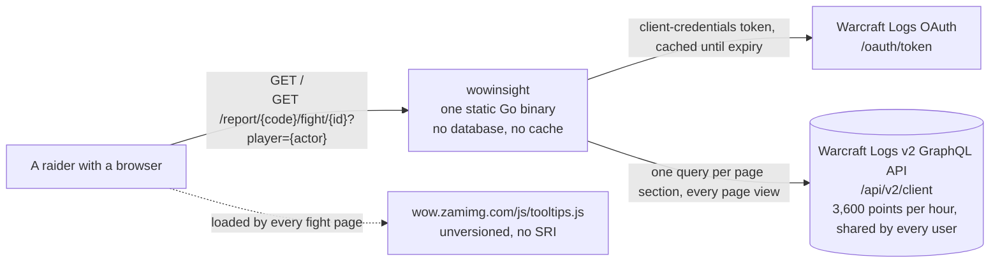
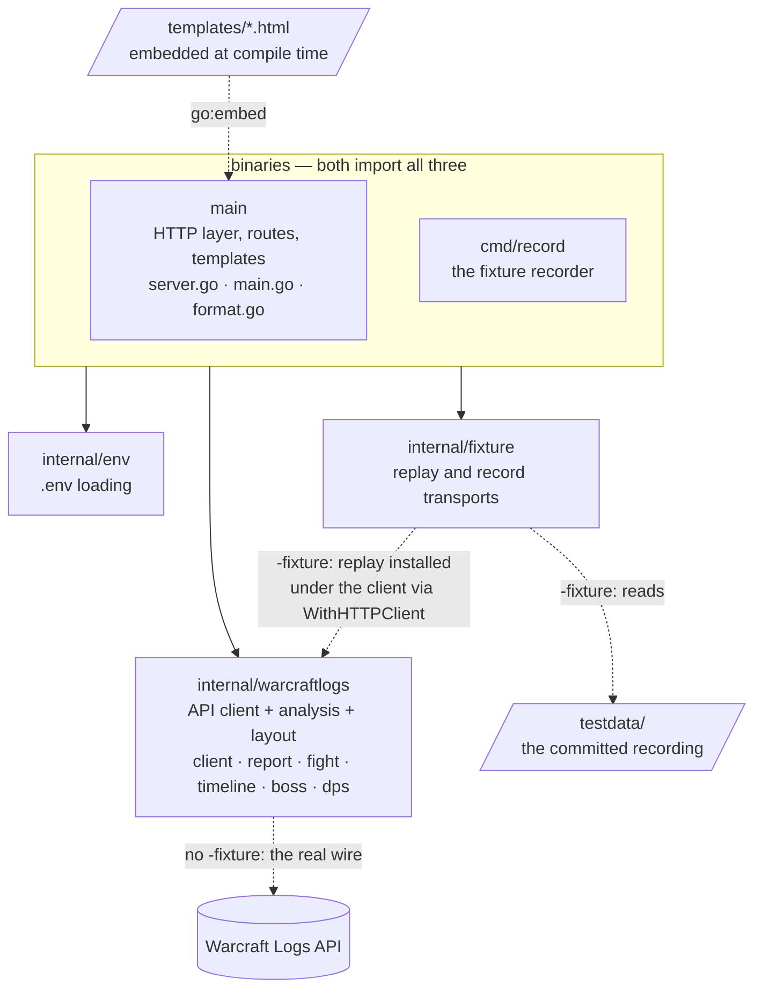
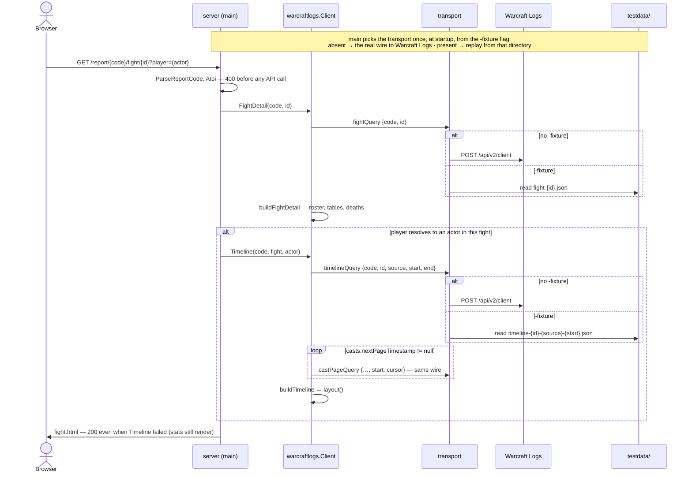

# Architecture

The map of this repository, for a human opening it cold and for an agent starting a
session. Three views, each answering one question. Read this before the code; it is
shorter than the code and it says where the seams are.

The **package view is verified by a test** (`architecture_test.go`): its solid edges must
match the real import graph, so it cannot go stale without the gate going red. The other
two views are kept true by hand — see *Keeping this true* at the end, and the rule in
`AGENTS.md`.

## 1. What talks to what

Who the system is for, and what it depends on outside the repository.

- The binary is the whole deployment. Nothing is stored between requests, so every page
  view re-queries the API against one hourly budget. #2 owns the cache; do not invent
  one.
- The tooltips script is the only third-party code that executes, and it runs with full
  origin privileges in the browser. It constrains any Content-Security-Policy work (#7).
- Credentials arrive from `.env` or the environment and are never sent anywhere but the
  OAuth endpoint.

## 2. How the code is organised

Five packages. Solid arrows are imports and are verified; an arrow leaving a group means
every package in the group has that import. Dotted arrows are relations that are not
imports, which is what makes them worth drawing — including the two wires the `-fixture`
flag chooses between: without it the client talks to Warcraft Logs, with it the replay
transport sits under the same client and answers from `testdata/`.

**The two seams**, which is where anything gets substituted:

| Seam | Declared in | What hangs on it |
| --- | --- | --- |
| `logsClient` — the four methods the handlers call | `server.go`, by the consumer | `fakeWCL` in tests; the cache decorator #2 will add |
| `http.RoundTripper` under the client, via `WithHTTPClient` | `internal/warcraftlogs/client.go` | the recorder and the replay in `internal/fixture` |

The replay sits *under* the client rather than beside it on purpose: a fake client can
return a `Timeline`, but not a laid-out one — `layout()` is unexported and runs only
inside `(*Client).Timeline`. `-fixture` reads the committed recording in `testdata/`
through that seam; `cmd/record` is how a human makes one, and is otherwise out of the
way. See `docs/decisions/2026-09-11-recorded-fixtures.md`.

**Inside `internal/warcraftlogs`**, one file per concern, and each fetch split from its
build: `fetchX` is a method on `*Client` that does I/O; `buildX` is a pure function from
the decoded response. `timeline.go` is by a wide margin the largest file — cast pairing,
aura and cooldown windows, phases and the layout pass — and its doc comments carry the
reasoning behind each heuristic. Read them before changing a builder.

**Known shape problems**, each owned by an issue: spec knowledge is package-level globals
(#16); presentation fields (`Percent`, `Row`, SVG strings) live on the analysis types
(#17); errors are strings shown verbatim (#12). `AGENTS.md` says how to build around them
in the meantime.

## 3. What happens on a fight page request

The one path that exercises everything. `Report` (the index page) is the same shape with
one query and no build step.

- The page degrades rather than fails: a `Timeline` error is logged and the stats render
  without it. Today that is indistinguishable from a player who cast nothing; #12 adds
  the notice.
- Every `*Timeline` a caller receives has been laid out. `layout()` is the last statement
  of `buildTimeline`, and `TestBuildTimelinePositionsEverything` pins it.
- The two flows are one code path with a different transport underneath. Everything
  from the client up — queries, paging, `build`, `layout()`, the template — is identical,
  which is what makes the offline page trustworthy. The recorder is the third transport:
  the real wire, with a copy kept of every response.

## Keeping this true

**Read this first, then the code.** If the code and this document disagree, do not
decide which one is wrong: raise it with the owner, with both versions side by side, and
wait. A drift can mean the document rotted, or that the code took a turn nobody agreed
to — and only the owner knows which.

**Structural changes are argued to the owner before they are built**, not presented as a
finished pull request. Structural means: a new package; a new edge between packages; a
new external system or third-party script; a new entry point (a binary, a route); a
changed seam. Adding a function or a type inside a package is not structural and needs
no check-in — only the diagram edit, if any.

**The package view is tested.** `architecture_test.go` reads the flowchart marked
`%% verified: package graph`, takes its solid `-->` edges, and compares them with the
import graph `go/build` reports for every package in the module. A package or import
edge missing from the diagram fails the gate; so does an edge the code no longer has.
Node ids are the last path segment of the package (`env`, `fixture`), and `main` for the
root. An edge from or to a `subgraph` stands for one edge per package inside it, so the
two binaries' identical imports are drawn once. Dotted edges (`-.->`) are not checked,
which is what they are for.

**The other two views are prose-maintained.** The pull request template asks whether this
document was updated or the change was not structural; answer it honestly. There is no
mechanism that can tell a sequence diagram is stale, only a reader who notices.
